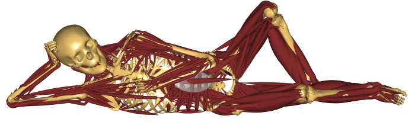

---
myst:
  html_meta:
    "description lang=en": |
      Top-level documentation for AnyPyTools, with links to the rest
      of the site..
html_theme.sidebar_secondary.remove: true
---

# AnyPyTools' documentation!

AnyPyTools is a toolkit for working with the AnyBody Modeling System from
Python.

:::{figure-md} 
:align: center



Don't panic
:::

Its main purpose is to launch AnyBody simulations and collect results. It has a
scheduler to launch multiple instances of AnyBody, utilising computers with multiple
cores. AnyPyTools makes it easy to do parameter and sensitivity and many other
things which is not possible directly within the AnyBody Modeling System.

## Installation

See the [install guide](user-guide/00_Install_and_Setup) for more details and
how the [pixi package manager](https://pixi.sh) can be used to also manage the
version of AnyBody which is used.

::::{tab-set}

:::{tab-item} pixi
```pwsh
pixi init
pixi add anypytools
```
:::

:::{tab-item} pypi
```pwsh
pip install anypytools
```
:::

:::{tab-item} conda
```pwsh
conda config --add channels conda-forge
conda install anypytools
```
:::
::::

## Guides

The guides walks you though how to use AnyPyTools to automate AnyBody Simulations. 

* [](user-guide/01_Getting_started_with_anypytools)
* [](user-guide/02_Generating_macros)
* [](user-guide/03_Working_with_output_from_Anybody)
* [](user-guide/04_Batch_processing_multiple_models)
* [](user-guide/05_Monte_Carlo_studies_etc)
* [](user-guide/06_Tips&Tricks)

:::{toctree}
:maxdepth: 2
:hidden:

User guide <user-guide/index>
::: 

## API Documenation

* [PyTest plugin for testing AnyBody models](pytest-plugin)
* [API reference](api/index)

:::{toctree}
:maxdepth: 2
:hidden:

API Reference <api>
:::


## How to cite?

If you use the library for publications please cite as:

```{rst-class} without-title
```

:::{seealso}
Lund et al., (2019). AnyPyTools: A Python package for reproducible research with the AnyBody Modeling System. Journal of Open Source Software, 4(33), 1108, <https://doi.org/10.21105/joss.01108>
:::

## Development

Contributions and feedback to AnyPyTools is greatly appreciated!  If you would like to contribute,
it is as easy as forking the [repository on GitHub](https://github.com/AnyBody-Research-Group/AnyPyTools), making your changes, and
issuing a pull request.  If you have any questions about this process don't
hesitate to ask.

See the {ref}`Developer's Guide <devguide>` for more information about contributing.

```{toctree}
:maxdepth: 1
:titlesonly: true

Contributing <devguide>
Changelog <changelog>
```

If you have questions or comments, please contact the author directly, or
open a [new issue on GitHub](https://github.com/AnyBody-Research-Group/AnyPyTools/issues/new)


